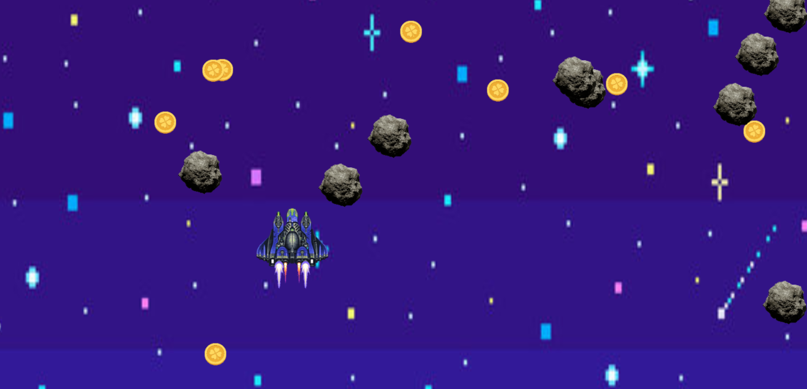
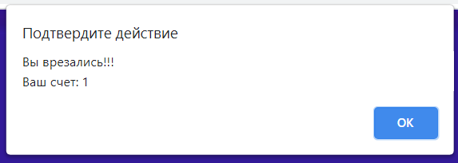

COURSEWORK - GAME 'Space'
---
Contacs:
_1.[Shukhman Veronica](https://github.com/nikelyandjelo)_
_2.[Litvin Andriy](https://github.com/Kapitan69)_

About our game
Our game is about a rocket that travels through space looking for coins. Collect coins as much as possible, after the end of the game you will see their number. If you crash into a meteorite that suddenly appears in your path, the game is over. Reload the page to start the game again.
Photo of our game

When you encounter a meteorite, you will see a window like this

